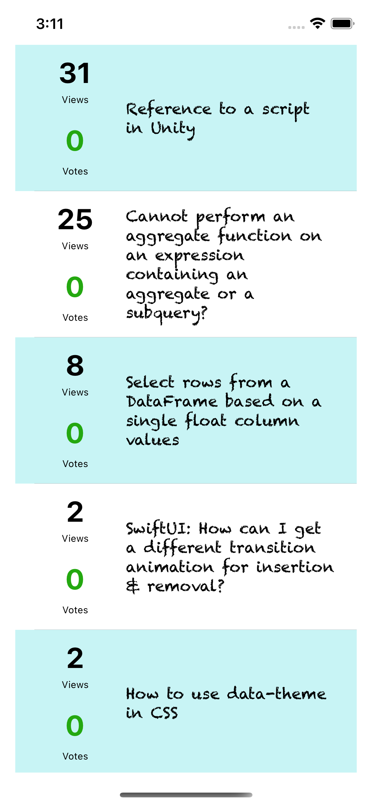

# Explore Networking

It is an exploratory iOS app to explore different networking options available
- [URLSession](https://developer.apple.com/documentation/foundation/urlsession) Networking without third party libraries
- [Alamofire](https://github.com/Alamofire/Alamofire) is an HTTP networking library written in Swift.
- [SwiftHTTP](https://github.com/daltoniam/SwiftHTTP): A simple Swift wrapper around NSURLSession
- [Moya](https://github.com/Moya/Moya): A Swift alternative to Alamofire.
- [Reach](https://github.com/Isuru-Nanayakkara/Reach): A simple Swift library to check if you have network.

The app currently has a very basic TableView to showcase different questions of StackOverflow. I have used StackExchange Questions API for site [StackOverflow](https://api.stackexchange.com/2.2/questions?site=stackoverflow)

```
https://api.stackexchange.com/2.3/questions?site=stackoverflow
```


### Useful Links
- https://medium.com/macoclock/alamofire-ios-advanced-techniques-95105c2f5889